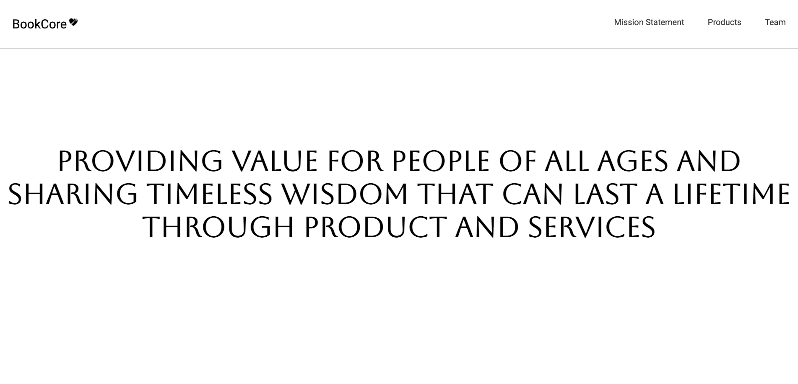

# PFF-Company-homepage
Responsive Company homepage. This is a project we worked on for fun to challenge our design and technical skills. Tell me what you think or give the project a star I don't mind ⭐️🤍

## Table of contents
- [Overview](#overview)
  - [The challenge](#the-challenge)
  - [Screenshot](#screenshot)
  - [Links](#links)
  - [Built with](#built-with)
  - [What I learned](#what-i-learned)
- [Author](#author)
- [Acknowledgments](#acknowledgments)

## Overview

Responsive Company homepage. This is a project we worked on for fun to challenge our design and technical skills. Tell me what you think or give the project a star I don't mine ⭐️🤍

### The challenge

Build a responsive website for a company of your choosing or make up your own, really, what you can do with the imagination is powerful. Requirements must be that the site is responsive to the browser and mobile users. GET BUILDING!

### Screenshot




### Links

- Solution URL: [Click here for code solution](https://github.com/UbaidRussell/PFF-Company-homepage-)
- Live Site URL: [View the Live Site Here](https://ubaidrussell.com/PFF-Company-homepage-/)


### Built with

- HTML
- CSS custom properties
- Flexbox
- Visual Studio Code


### What I learned
This code was intersting to us and taught us how we can create the snap scroll effect that allows content to take up a whole page and well, snap scroll.

```css
section {
    scroll-snap-align: start;
    scroll-snap-stop: always;
    display: flex;
  }
  section:nth-of-type(even) {
    color: white;
    background: black;
  }
  
  section:nth-of-type(odd) {
    color: black;
    background: white;
  }

```

## Author

- Website - [UbaidRussell.com](https://ubaidrussell.com/)
- Frontend Mentor - [@UbaidRussell](https://www.frontendmentor.io/profile/UbaidRussell)
- Twitter - [@Ubaidussell](https://www.twitter.com/UbaidRussell)


## Acknowledgments
Shoutout to all the developers who created the tools for me to create and make this possible 🤍